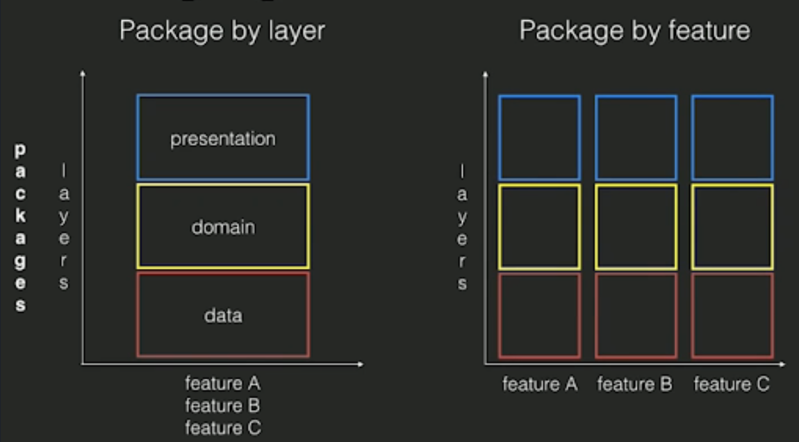
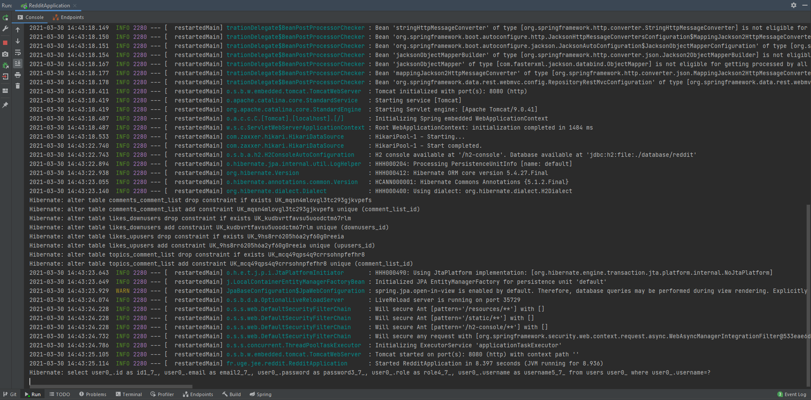
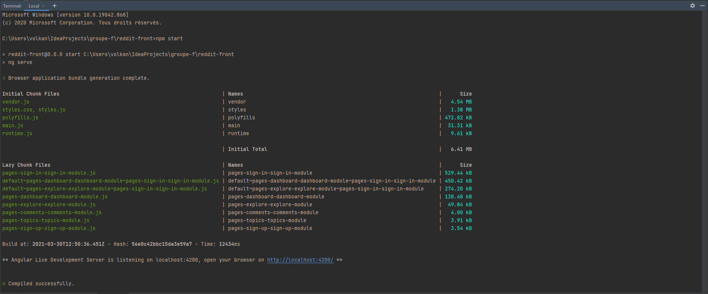
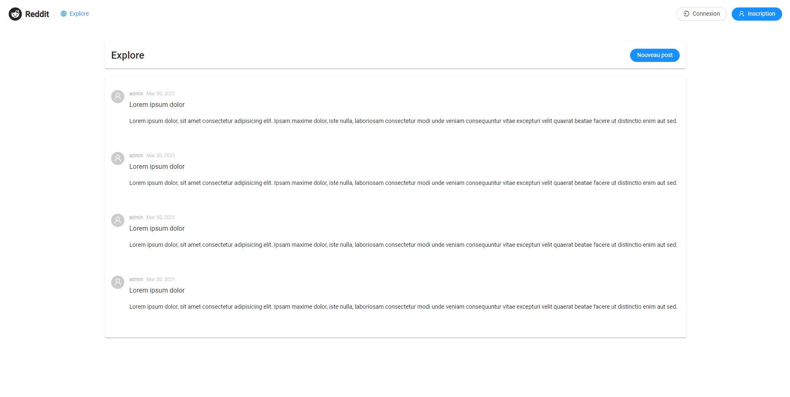

# Reddit

Ce projet réalise un forum de discussion qui est une version simplifiée [Reddit](http://www.reddit.com).
Pour ce projet nous étions un groupe de quatre étudiants.

# Architecture et choix technique

## Package by feature




Nous avons choisis l'architecture package by feature pour que nous puissions plus simplement nous répartire les taches, ainsi les package *user*, *auth* et  *config* on été developé par [Mamadou CISSE](https://gitlab.com/mciissee) et [Eric TRAN](https://gitlab.com/etran2907), le package topic a été developé par [Volkan ZULAL](https://gitlab.com/volkanzulal) et [Zacharie SOUIOUED](https://gitlab.com/ZacharieSouioued).

## Sécurité


Pour garantir la sécurité des connexions et des mot de passe, nous avons utiliser la librairy spring security, permetant de gérer les sessions de connexions. Spring Security est un cadre d'authentification et de contrôle d'accès puissant et hautement personnalisable. Il s'agit du standard de facto pour la sécurisation des applications basées sur Spring.

Spring Security est un framework qui se concentre sur la fourniture d'authentification et d'autorisation aux applications Java. Comme tous les projets Spring, la véritable puissance de Spring Security réside dans la facilité avec laquelle il peut être étendu pour répondre à des besoins spécifiques.

## REST 


Tous d'abord REST est un ensemble de principes d'architecture. 
Lorsqu'une demande est effectuée via une API RESTful, l'API transmet une représentation de l'état de la ressource au demandeur.
L'information, ou représentation, est fournie via le protocole HTTP dans le format JSON car, il ne dépend pas d'un langage et peut être lu aussi bien par les humains que par les machines.
Notre API remplit les critères suivants : 
- Une architecture client-serveur composée de clients, de serveurs et de ressources, et ses requêtes sont gérées via HTTP
- Communication client-serveur sans état, c'est-à-dire que les informations client ne sont jamais stockées entre les demandes, et les informations client doivent être traitées séparément et de manière totalement indépendante
- Possibilité de mettre en cache les données pour simplifier l'interaction client-serveur
- L'interface unifiée entre les composants permet de réaliser la transmission standardisée d'informations.

Nous avons opté pour une architecture REST au niveau des controller, cela permet de rendre indépendant le front et le back, ainsi vous pouvez accéder au données via le front, le swagger ou en faisant des POST et GET via un postman, vous pouvez même créer votre propre front et faire des requéte sur notre back.

Cela facilite la mise à l'échele du projet, ainsi que sont déploiment dans le cloud, en docker kubernetes.

## Convention

### REST

Nous avons choisis la convention REST pour nos réquette. 

### Semantic Commit Messages

Format: `<type>(<scope>): <subject>`

`<scope>` est optionel

## Exemple

```
feat: ajout systeme de Vote
^--^  ^------------^
|     |
|     +-> résumé au présent.
|
+-------> Type: chore, docs, feat, fix, refactor, style, or test.
```

Plus d'exemple:

- `feat`: (nouvel feature pour l'utilisateur)
- `fix`: (correction de bug pour l'utilisateur)
- `docs`: (changement dans documentation)
- `style`: (changement d'indentation etc, pas de changement technique)
- `refactor`: (refactor du code, exemple changement du nom de variable)
- `test`: (ajout de test)

# Front end (Angular) 

Nous avons choisi de le faire en Angular. Développé par Google, est un framework open source écrit en JavaScript 
qui permet la création d'applications Web, en particulier les «Single Page Applications » : des applications Web accessibles 
via une seule page Web, simplifiant l'expérience utilisateur et d’éviter les chargements de pages à chaque nouvelle action. 


# Guide d'utilisation

## Lancement du Back-end 

Après avoir cloné le repository sur votre machine vous devez l'ouvrir sur IDE (IntelliJ ou VS Code).
Pour le lancer vous devez tout d'abord lancé le back qui se trouve dans le dossier `cd reddit-back`.
Vous pouvez le lancer en faisant un simple run du fichier `RedditApplication.java`.
IntelliJ vous affichera un message comme ceci.  



Vous aurez accées au swagger de notre application par ce [lien](http://localhost:8080/swagger-ui/index.html?configUrl=/v3/api-docs/swagger-config#/) :`http://localhost:8080/swagger-ui/index.html?configUrl=/v3/api-docs/swagger-config#/`.

## Lancement du Front-end

Le front est codé en Angular. Tout d'abord vous devez avoir `npm` et `node` d'installer sur votre machine si cela n'est 
pas le cas aller sur ce [lien](https://www.npmjs.com/get-npm).

Une fois que votre machine est prête vous devez vous rendre dans le dossier `cd reddit-front`

Puis vous pouvez lancer le front en utilisant la commande suivante :

`npm run start`

Votre terminal va vous renvoyer un lien sur lequel vous pouvez consulter le front comme ceci.



Une fois que vous vous rendez sur le lien [`http://localhost:4200/`]( http://localhost:4200/). Cette page apparait sur votre navigateur.



Une fois que l'application est lancé vous pouvez tester le back grâce au front de manière plus agréable et plus simple.
